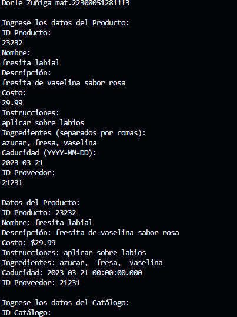
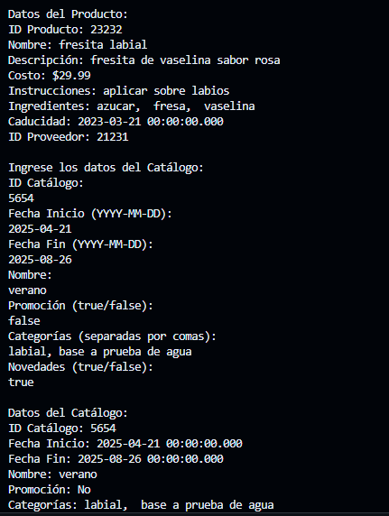
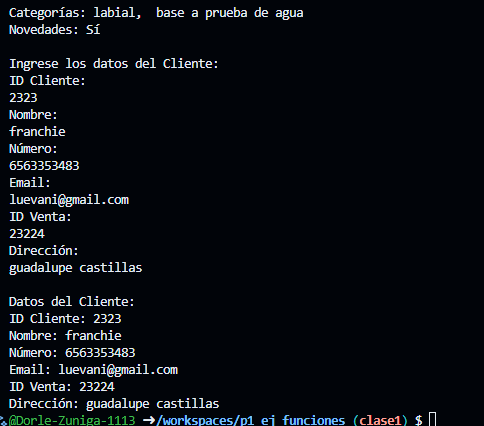

crear una clase productos con atributos (id_producto, nombre, descripcion, costo, instrucciones,ingredientes, caducidad y id_proveedor),otra con el nombre de la clase catalogo (id_catalogo, fecha_inicio, fecha_fin, nombre, promocion, categorias, novedades)  y otra clase clientes(id_cliente, nombre, numero, e-mail, id_venta, direccion) con una funcion captura desde la interfaz y otra mostrar datos(), crear la instancia y utilizar los atributos y llamadas a funciones lenguajes dart

salida de datos

