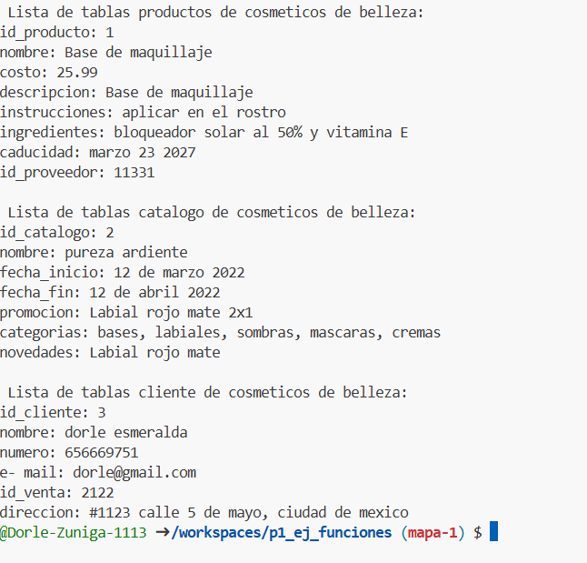

crear map string dinamic medicamentos con los siguientes key, id_medicamento,nombre, precio y mostrar con foreach  lenguaje dart
lo cambiamos a nuestras tablas 
tabla de productos, catalogo, y cliente en mi tienda de cosmeticos
